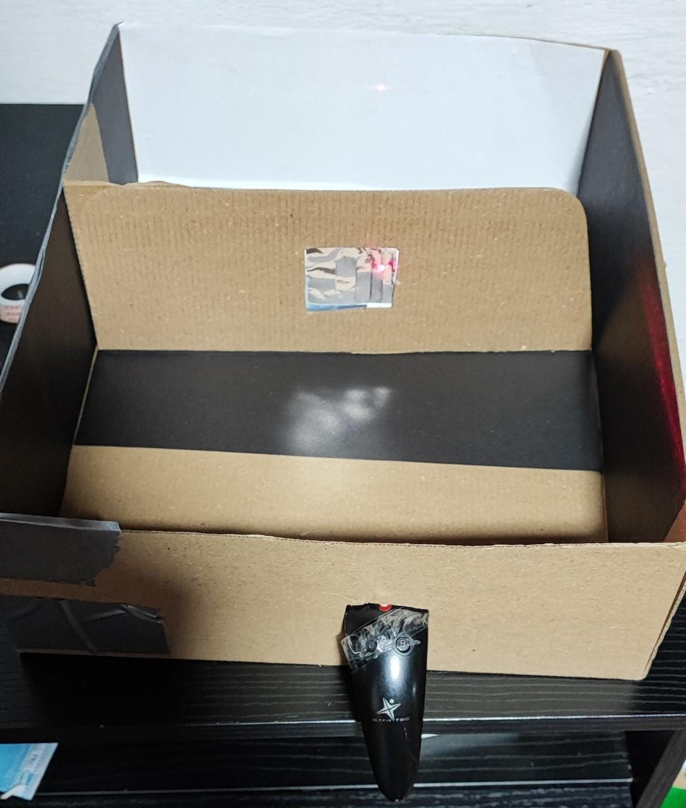
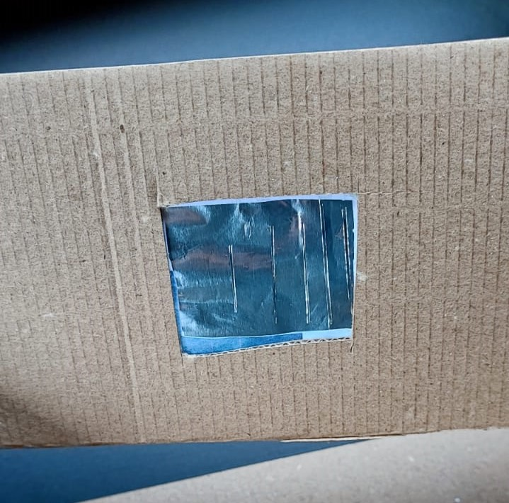

# Experimento-Doble-rendija
En este repositorio se mostrará un experimento de la Doble Rendija y su explicación tomando como base la computación cuántica

## Explicación Cientifica 
Este experimento se realizó primera vez, utilizando luz, por Thomas Young en 1801 como demostración del comportamiento ondulatorio de la luz, pero con el pasar de los años y diversas observaciones realizadas al experimento, la ciencia ha logrado determinar que esto no es del todo cierto.

Si pensamos en una pequeña parte de la luz como un átomo (o una pepa) que sale disparada desde el laser hasta la pared entonces aparece una marca en la misma. Dependiendo del lugar donde apuntemos el laser, el atomo aparecerá como un punto en la pared en dicha dirección; Ahora, con la doble rendija se plantea que el mismo átomo pasa por ambas rendijas (no se divide ni se centra en una sola rendija) creando así un multiverso y que para un solo estado inicial, apenas la pepa toque la doble rendija tendrá las mismas posibilidades divididas de pasar por una rendija o por la otra.

Al encender el laser y apuntarlo hacia la rendija estamos enviando una increible cantidad de atomos que por el modelo probabilistico tomarán diferentes caminos agrupandose así en una dispersion centrada en un gran punto pero a medida que este se aleja el punto se duplica y reduce su tamaño.

## Simulación 
Para las simulaciones utilizamos un modelo mátematico basado en los grafos del sistema y las matrices adyacencia propias de los mismos, posteriormente realizamos una simulación en la librería de complejos java importando la libreria del github http://github.com/AlejandroBohal

**Explicación e imágenes**
En el siguiente gráfo veremos dos modelos: uno con coeficientes reales y otro con coeficientes complejos

**Codigo**
Haciendo uso de la anterior libreria podemos crear una función que simule los estados del sistema y sus probabilidades 

**1 click**
Acá podemos apreciar el resultado del estado y su probabilidad luego de un click

Estado:

 
 Probabilidad:
 

**2 click**

Estado:

Probabilidad:

**Coeficientes complejos**

**1 click**

Estado

Probabilidad

**2 click**

Estado

Probabilidad

## Construcción 
**Materiales:**
* Caja de carton 
* Un laser
* Bisturi 
* Aluminio  
* Cartulina negra 
* Pegamento

**Pasos:**

* Con ayuda del bisturi, en un rectángulo de carton creamos una ventana
* En un cuadrado de tamaño proporcional a la anterior ventan, realizamos dos cortes paralalelos y con una distancia de no mayor a 0,3 mm 
* Pegamos el cuadrado de aluminio a la ventana dejando así los cortes expuestos
* En los laterales internos de la caja pegamos cartulina negra para reducir la luz
* En el lado de la caja en el cual se verá reflejado el experimento pegamos una hoja blanca de papel
* Ubicamos el laser de manera que podamos apreciar el efecto de la doble rendija para luego fijarlo a essta posción.

**Imagenes**

## Resultado 

https://user-images.githubusercontent.com/123709637/223311279-c751c1d6-5556-4a12-ae6a-627f941b4363.mp4

## Autores
Tomas Suarez

Hernan Sanchez

Yonatan Yesid Suarez
